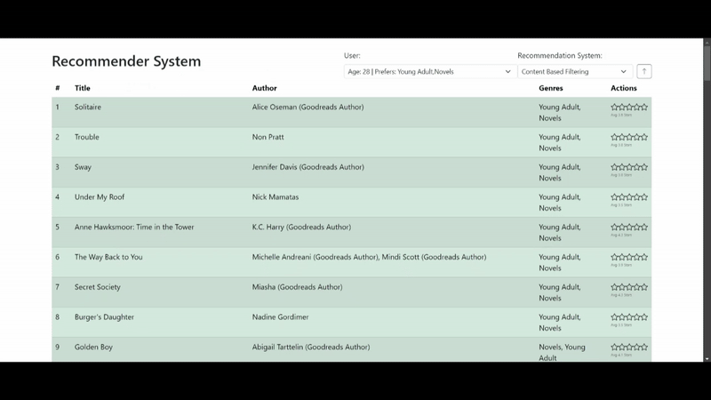

# Book Recommendation System

## Purpose
This software is a comprehensive Book Recommendation System designed to suggest books to users based on their preferences, behaviors, and interactions. The system leverages multiple state-of-the-art recommendation algorithms, including both traditional and reinforcement learning-based approaches, to provide personalized book suggestions.

## Implemented Recommendation Techniques
The backend implements five distinct types of recommendation systems:

1. **Content-Based Filtering (CBF)**
   - Recommends books by analyzing the features of books (such as genres, authors, and descriptions) and matching them to the user's stated or inferred preferences.

2. **Collaborative Filtering (User-Based, CFU)**
   - Suggests books based on similarities between users. If two users have similar reading or rating histories, books liked by one user are recommended to the other.

3. **Collaborative Filtering (Item-Based, CFI)**
   - Recommends books that are similar to those the user has already liked or interacted with, based on patterns of co-occurrence in user histories.

4. **Q-Learning (Reinforcement Learning)**
   - Utilizes a Q-Learning algorithm to model the recommendation process as a sequential decision-making problem. The system learns optimal recommendation strategies by receiving feedback (rewards) from user interactions, adapting over time to maximize user satisfaction. This approach is particularly powerful for capturing long-term user engagement and dynamic preferences.

5. **Deep Q-Network (DQN, Reinforcement Learning)**
   - An advanced reinforcement learning method that combines Q-Learning with deep neural networks. DQN can handle large and complex state spaces, enabling the system to learn sophisticated recommendation policies from user data. This method is experimental and aims to push the boundaries of adaptive, intelligent recommendations.

## How to Run the System

### Backend (API)
1. Navigate to the `Api/` directory.
2. Install the required Python dependencies (you may need a virtual environment):
   ```bash
   pip install -r requirements.txt
   ```
3. Start the backend server:
   ```bash
   python api.py
   ```
   The backend will run by default on `http://localhost:5000/` (or as configured in the code).

### Frontend (Angular)
1. Navigate to the `frontend/` directory.
2. Install the required Node.js dependencies:
   ```bash
   npm install
   ```
3. Start the Angular development server:
   ```bash
   ng serve
   ```
   The frontend will be available at `http://localhost:4200/`.

---

## Demo

Watch a demo of the system in action:



---
